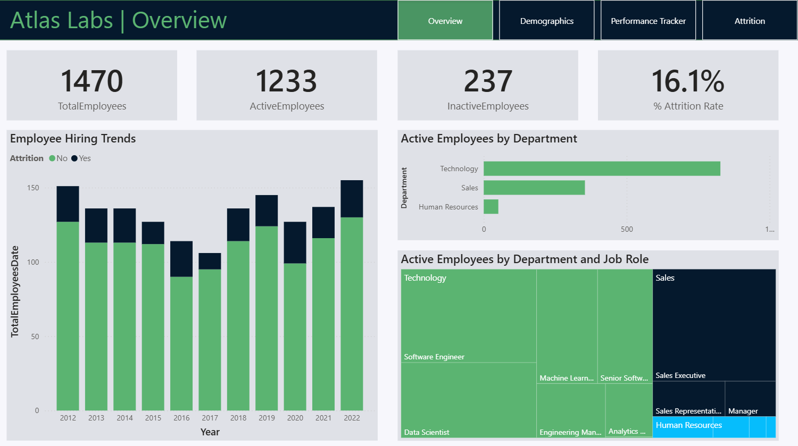
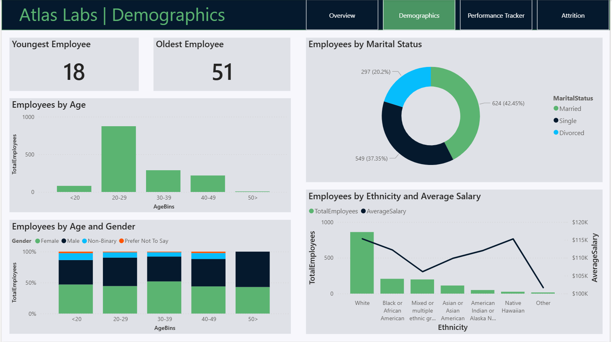
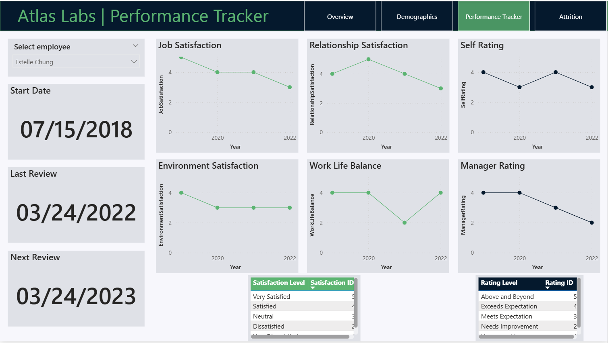
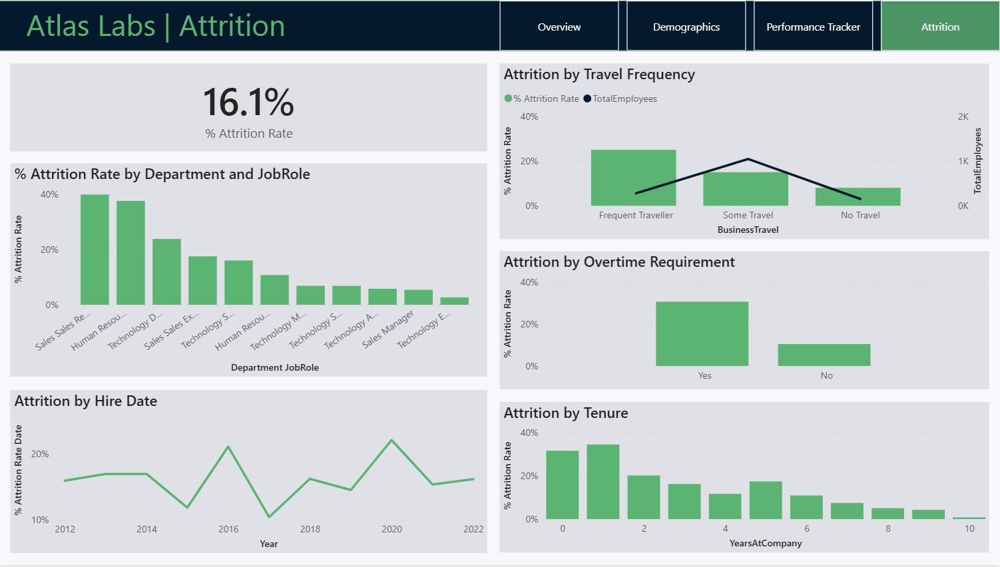

# HR Analytics Dashboard in Power BI

## 📌 Project Overview
This project is an **HR Analytics dashboard** developed in **Power BI** for a fictitious software company, **Atlas Labs**. It was created as part of DataCamp's Case Study: **HR Analytics in Power BI** course. The dashboard analyzes various aspects of HR data — from demographics to attrition — with interactive and insightful visualizations.

---

## 🚀 Key Features
- **Employee Demographics Analysis**: Understand age, gender, and ethnic diversity to support Diversity & Inclusion goals.
- **Hiring Trends**: Analyze hiring trends over time to support strategic workforce planning.
- **Performance Tracking**: Monitor employee performance and satisfaction through yearly reviews.
- **Attrition Analysis**: Explore factors influencing employee turnover, including travel frequency and department.
- **Interactive Navigation**: Easy-to-navigate report pages for enhanced user experience.

---

## 🧠 Project Highlights
- **Data Modeling & EDA**: Connected multiple tables and explored HR metrics using Power BI.
- **DAX Calculations**: Built measures with `CALCULATE`, `USERELATIONSHIP`, etc., for metrics like attrition rate and satisfaction score.
- **Custom Visuals**: Used treemaps, line charts, and stacked bars for a clearer visual narrative.
- **Branded Layout**: Clean and intuitive report design optimized for HR teams.

---

## 📂 Repository Structure
- `HR analytics.pbix` – Main Power BI dashboard file  
- `*.png` – Snapshot images of each report page (used in this README)

---

## 🛠️ Requirements
- Power BI Desktop (latest version recommended)

---

## 📈 Dashboards Preview

### 1. **Overview Dashboard**  
Snapshot of total employees, hiring trends, and department distribution  

---

### 2. **Demographics Dashboard**  
Breakdown of age, gender, marital status, and ethnicity  

---

### 3. **Performance Tracker**  
Tracks employee performance and satisfaction across departments  

---

### 4. **Attrition Dashboard**  
Analyzes employee attrition trends, travel frequency, and attrition rates by category  

---

## 🔍 Key Insights
- Most employees are between **20–29 years old**.
- **Women make up 2.7% more** of the workforce than men.
- **Non-binary employees** represent **8.5%** of the workforce.
- **White employees** earn the highest average salary, while **"Mixed or multiple ethnic groups"** earn one of the lowest.
- **Frequent travelers**, although only **19%** of hires, show a **higher attrition rate**, indicating that travel requirements may affect retention.

---

## 🧾 About the Project
This dashboard helps **Atlas Labs**' HR team monitor key workforce metrics to make data-driven decisions on hiring, diversity, performance, and employee retention.

---

## 📥 How to Use
Download the `.pbix` file and open it using Power BI Desktop to explore the interactive dashboard.

